# Context Mapping: Managing Strategic Design Boundaries

## Overview

As software systems grow beyond a single team or domain, multiple models inevitably emerge. Each model has its own language, concepts, and internal consistency. The Context Map is a strategic design tool that makes these boundaries explicit and defines how different Bounded Contexts relate to and integrate with each other.

## The Problem: Model Fragmentation

In large projects:
- The same term means different things in different parts of the system (e.g., "Customer" in Sales vs. Support)
- Teams make conflicting assumptions about shared concepts
- Integration between subsystems becomes a source of confusion and bugs
- Unclear ownership of integration logic
- Models inadvertently influence each other, creating unwanted coupling

## The Solution: Bounded Contexts and Context Maps

### Bounded Context

**A Bounded Context is an explicit boundary within which a particular model is defined and applicable.**

Key characteristics:
- Has a clear linguistic boundary (Ubiquitous Language)
- Maintains internal consistency
- Usually aligns with team boundaries
- May represent a subdomain (Core, Supporting, Generic)
- Can be implemented as a microservice, module, or subsystem

**Example Bounded Contexts in E-Commerce:**
- **Sales Context**: Customer (buyer profile, preferences), Order (shopping transaction), Product (catalog item)
- **Fulfillment Context**: Customer (shipping address), Order (fulfillment request), Product (inventory item)
- **Support Context**: Customer (support history, tickets), Product (troubleshooting info)

Notice: "Customer," "Order," and "Product" exist in all three contexts but mean subtly different things in each.

### Context Map

**A Context Map is a document that shows all Bounded Contexts in play and the relationships between them.**

The Context Map serves multiple purposes:
1. **Communication tool** - Makes architectural landscape visible to all stakeholders
2. **Integration guide** - Defines how contexts should integrate
3. **Organizational alignment** - Shows team boundaries and responsibilities
4. **Risk assessment** - Highlights problematic relationships or dependencies

## Context Relationship Patterns

Each relationship between contexts follows a pattern that defines integration strategy and team dynamics.

### 1. Partnership

**Definition:** Two contexts in a cooperative relationship where teams coordinate closely for mutual success. Neither can succeed without the other.

**Characteristics:**
- Mutually dependent development
- Coordinated planning and release schedules
- Joint responsibility for integration
- Failures in one affect the other

**When to use:**
- Two systems must evolve together (e.g., mobile app and backend API during initial development)
- Strong business alignment between teams
- Frequent coordination is already happening naturally

**Integration approach:**
- Continuous integration between the two contexts
- Shared test suites across boundaries
- Joint architectural decisions

**Example:**
```
[Ordering Context] <--- Partnership ---> [Inventory Context]
```
When implementing real-time inventory reservation during checkout, both teams collaborate on the integration protocol and timing.

**Risks:**
- High coordination overhead
- Can slow down both teams if not managed well
- May indicate contexts are poorly bounded

---

### 2. Shared Kernel

**Definition:** A subset of the domain model that is shared explicitly between two or more contexts. Changes require consensus.

**Characteristics:**
- Small, well-defined shared subset
- Cannot be changed unilaterally
- Typically includes fundamental domain concepts
- Often implemented as a shared library or module

**When to use:**
- Closely related contexts with significant overlap
- Cost of duplication outweighs cost of coordination
- Shared concepts are stable and well-understood

**Integration approach:**
- Shared code repository or library
- Joint code ownership
- Frequent integration/testing
- Changes require agreement from all teams

**Example:**
```
[Sales Context] <--- Shared Kernel ---> [Billing Context]
                  (Money, Currency,
                   PaymentStatus types)
```

**What to share (typical candidates):**
- Fundamental value objects (Money, Address)
- Core domain events
- Shared enumerations or type definitions

**What NOT to share:**
- Entities (too high coupling)
- Services
- Large aggregates

**Risks:**
- Overhead of coordinating changes
- Coupling between contexts
- Can grow too large if not carefully managed

**Best practice:** Keep the Shared Kernel as small as possible. Set up a continuous integration process that runs tests for all affected contexts when the kernel changes.

---

### 3. Customer/Supplier Development

**Definition:** Two contexts in an upstream/downstream relationship where the downstream (customer) depends on the upstream (supplier), but the downstream team has some influence over the upstream team's priorities.

**Characteristics:**
- Upstream provides services/data to downstream
- Downstream can negotiate features and priorities
- Upstream team factors downstream needs into planning
- Clear customer/supplier relationship

**When to use:**
- Natural service provider/consumer relationship
- Downstream team has leverage or political influence
- Upstream team is motivated to satisfy downstream needs
- Organizations want to maintain some coupling without full partnership

**Integration approach:**
- Formal contracts or API specifications
- Downstream team articulates needs via requirements, user stories, or tickets
- Regular planning meetings to align on priorities
- Automated acceptance tests defined by downstream

**Example:**
```
[Identity/Auth Context] ---> supplies to ---> [Sales Context]
     (upstream)                                  (downstream)
```

The Sales team needs authentication services and can request features (e.g., "add OAuth support"), and the Identity team considers these requests in their backlog.

**Downstream responsibilities:**
- Clearly articulate needs
- Provide acceptance criteria
- Adapt to upstream's planned changes

**Upstream responsibilities:**
- Consider downstream needs in planning
- Provide stable interfaces
- Give advance notice of breaking changes

**Risks:**
- Can devolve into Conformist if upstream ignores downstream
- Negotiation overhead
- Downstream still vulnerable to upstream changes

---

### 4. Conformist

**Definition:** Downstream context strictly conforms to the model of the upstream context. No translation layer.

**Characteristics:**
- Downstream has no influence on upstream
- Downstream adopts upstream model as-is
- No negotiation or adaptation by upstream
- Simplifies integration but creates coupling

**When to use:**
- Upstream model is good enough for downstream needs
- Cost of translation exceeds benefit
- Downstream team lacks leverage to negotiate
- Upstream is a stable, mature system with a reasonable model

**Integration approach:**
- Directly use upstream's API, DTOs, or domain model
- Accept upstream's language and concepts
- Track upstream changes and adapt immediately

**Example:**
```
[External Payment Gateway] ---> [Billing Context] (Conformist)
```

The Billing Context uses the payment gateway's exact terminology (authorization codes, merchant IDs, etc.) without translation.

**Advantages:**
- Simplicity: no translation layer to maintain
- Easy integration
- Fast to implement

**Disadvantages:**
- Tight coupling to upstream
- Upstream changes force downstream changes
- Downstream model may become awkward or unclear
- Loss of autonomy

**Critical question to ask:** "Does conforming hurt our model?" If yes, consider an Anticorruption Layer instead.

**When Conformist is appropriate:**
- The upstream model is well-designed and aligned with downstream needs
- Integration is simple and translation would add little value
- Downstream context is small or supporting

---

### 5. Anticorruption Layer (ACL)

**Definition:** Downstream context creates a translation layer (the Anticorruption Layer) that isolates it from the upstream model, preventing upstream concepts from "corrupting" the downstream model.

**Characteristics:**
- Downstream creates a protective barrier
- Translates between upstream and downstream models
- Allows downstream model to evolve independently
- Adds complexity but provides autonomy

**When to use:**
- Upstream model is poor, complex, or misaligned
- Downstream model must remain pure and domain-focused
- Upstream is a legacy system
- Upstream is an external system you don't control
- Protecting core domain from external dependencies

**Integration approach:**
- Create adapter/facade in downstream context
- Translate upstream concepts to downstream concepts
- Encapsulate all interaction with upstream behind ACL
- Test ACL thoroughly for translation accuracy

**Example:**
```
[Legacy ERP System] ---> [ACL] ---> [Modern Ordering Context]
```

The ACL translates legacy ERP's customer codes and SKU identifiers into the modern Ordering Context's Customer and Product domain objects.

**ACL Implementation Patterns:**

**Facade:** Provides a simplified interface to upstream complexity
```java
// Upstream has complex API
public class LegacyCustomerService {
    CustomerRecord getCustomerByCode(String code, int regionId, boolean includeInactive);
}

// ACL Facade simplifies and translates
public class CustomerAdapter {
    public Customer findCustomer(CustomerId id) {
        CustomerRecord record = legacyService.getCustomerByCode(id.getValue(), DEFAULT_REGION, false);
        return translateToCustomer(record);
    }
}
```

**Adapter:** Adapts upstream interface to downstream expected interface

**Translator:** Converts between model representations

**Layers:**
- Service Layer: Interacts with upstream API
- Translation Layer: Converts data structures
- Domain Interface: Exposes downstream-friendly interface

**Advantages:**
- Protects downstream model integrity
- Allows independent evolution
- Isolates complexity
- Reduces blast radius of upstream changes

**Disadvantages:**
- Additional development and maintenance effort
- Performance overhead (translation)
- Complexity in ACL itself
- Dual-model concepts (can confuse team)

**Best practices:**
- Keep ACL as thin as possible
- Test translation thoroughly
- Document mapping decisions
- Consider ACL as infrastructure, not domain code
- Review ACL when upstream changes

---

### 6. Open-Host Service

**Definition:** Upstream defines a public protocol or API that provides access to its services, designed to serve multiple downstream consumers.

**Characteristics:**
- Upstream provides a well-defined, stable API
- Protocol is documented and versioned
- Designed for general use, not specific consumers
- Often combined with Published Language

**When to use:**
- Multiple downstream contexts need upstream services
- Upstream wants to minimize coupling to specific consumers
- Public or semi-public API is needed
- Upstream model is mature and stable

**Integration approach:**
- RESTful API, GraphQL, gRPC, or message protocol
- Versioned, documented interface
- Backward compatibility commitments
- Service-level agreements (SLAs)

**Example:**
```
[Product Catalog Context] --- Open-Host Service (REST API) ---> [Sales Context]
                                                            ---> [Support Context]
                                                            ---> [Marketing Context]
```

The Product Catalog exposes a RESTful API that all other contexts consume.

**Often paired with Published Language:**

When the Open-Host Service uses a well-documented, standardized data format (JSON schema, Protocol Buffers, XML schema), it becomes a **Published Language**—a common medium for communication.

**Example Published Languages:**
- JSON:API specification
- OpenAPI/Swagger definitions
- Protocol Buffers schemas
- Domain-specific standards (HL7 for healthcare, FIX for finance)

**Advantages:**
- Decouples upstream from downstream specifics
- Scales to many consumers
- Clear contract for integration
- Easier versioning and evolution

**Disadvantages:**
- Requires investment in API design and documentation
- Must maintain backward compatibility
- May not perfectly fit any single consumer's needs (generalization cost)

---

### 7. Separate Ways

**Definition:** Two contexts have no integration at all. They operate independently, with no connection or shared data.

**Characteristics:**
- No dependencies between contexts
- Complete autonomy
- May have duplicate concepts handled independently
- Simplest relationship (no relationship)

**When to use:**
- Integration cost exceeds business value
- Contexts serve entirely different purposes
- Duplication is acceptable
- Bounded contexts are truly independent

**Example:**
```
[HR Management Context]    (no connection)    [E-Commerce Context]
```

HR and E-Commerce may both have "Employee" concepts, but there's no business need to integrate them.

**Advantages:**
- Maximum autonomy
- No coordination overhead
- Simple to reason about
- No integration complexity

**Disadvantages:**
- Potential duplication
- May miss valuable synergies
- Data inconsistency across contexts (if they accidentally overlap)

**Critical question:** "Is integration truly unnecessary, or are we avoiding hard integration work?"

---

## Creating a Context Map

### Step 1: Identify Bounded Contexts

Ask:
- What distinct models exist in the system?
- What are the team boundaries?
- Where do linguistic boundaries occur?
- What subdomains (core, supporting, generic) exist?

### Step 2: Name the Contexts

Give each context a clear, meaningful name:
- Sales Context
- Fulfillment Context
- Identity and Access Context
- Product Catalog Context

### Step 3: Draw the Boundaries

Represent each context as a box or bubble. Include:
- Context name
- Key concepts/aggregates
- Owning team

### Step 4: Identify Relationships

For each pair of contexts that interact:
- Who is upstream? Who is downstream?
- What is the power dynamic?
- What integration pattern applies?

### Step 5: Document Integration Details

For each relationship, note:
- Integration technology (REST, messaging, shared DB)
- Frequency of interaction
- Data exchanged
- Known issues or risks

### Step 6: Review and Evolve

Context Maps are living documents:
- Review regularly with architects and teams
- Update when relationships change
- Use to guide architectural decisions

## Example Context Map

```
                    [Identity Context]
                     (Open-Host Service)
                            ↓
                            ↓ (REST API)
                            ↓
    +-------------------+-------------------+
    ↓                   ↓                   ↓
[Sales Context] ← Partnership → [Inventory Context]
    ↓
    ↓ (Customer/Supplier)
    ↓
[Billing Context]
    ↓
    ↓ (ACL)
    ↓
[Legacy Payment System]


[Support Context] (Separate Ways from all others)
```

**Visual Context Map:**

```mermaid
flowchart TB
    Identity[Identity Context<br/>🌐 Open-Host Service]
    Sales[Sales Context]
    Inventory[Inventory Context]
    Billing[Billing Context]
    Payment[Legacy Payment<br/>System]
    Support[Support Context]

    Identity -->|REST API| Sales
    Identity -->|REST API| Inventory
    Sales <-->|Partnership| Inventory
    Sales -->|Customer/Supplier| Billing
    Billing -->|ACL| Payment

    style Identity fill:#FFD700
    style Sales fill:#90EE90
    style Inventory fill:#90EE90
    style Billing fill:#87CEEB
    style Payment fill:#FFB6C1
    style Support fill:#D3D3D3
```



**Relationships explained:**
- Identity provides authentication (Open-Host Service) to Sales
- Sales and Inventory coordinate closely (Partnership) for real-time stock checks
- Sales supplies order data to Billing (Customer/Supplier)
- Billing protects itself from Legacy Payment System (ACL)
- Support operates independently (Separate Ways)

## Strategic Decisions Informed by Context Maps

### 1. Where to Invest
- Focus refactoring and design effort on Core Domain contexts
- Minimize investment in Generic Subdomains
- Identify risky integrations (e.g., Conformist to unstable upstream)

### 2. Team Organization
- Align teams to Bounded Contexts
- Partnership patterns require co-located or closely coordinating teams
- ACL patterns allow teams to work more independently

### 3. Integration Strategy
- Where to place translation logic (downstream ACL vs. upstream Open-Host Service)
- When to use synchronous vs. asynchronous integration
- Where to establish contracts and versioning

### 4. Risk Management
- Identify single points of failure (contexts with many dependents)
- Spot problematic Conformist relationships
- Plan for change: which contexts are likely to evolve rapidly?

## Common Pitfalls

### 1. Fuzzy Context Boundaries
Contexts that aren't truly bounded lead to model confusion.

**Solution:** Clarify linguistic boundaries. Each context should have its own Ubiquitous Language.

### 2. Overly Large Contexts
Context that encompasses too much becomes unwieldy.

**Solution:** Look for sub-models within the context that could be separated.

### 3. Unstated Assumptions
Teams assume integration patterns without explicit agreement.

**Solution:** Make the Context Map visible and review it regularly.

### 4. Ignoring Political Realities
Choosing Partnership when one team actually dominates.

**Solution:** Be honest about power dynamics. Conformist or Customer/Supplier may be more realistic.

### 5. Premature Shared Kernel
Sharing code too early creates coupling before boundaries are clear.

**Solution:** Start with duplication or Partnership. Only introduce Shared Kernel when boundaries stabilize.

## Tools for Context Mapping

### Visual Notation
- Simple boxes and arrows
- UML-style diagrams
- Hand-drawn sketches
- Specialized tools (Context Mapper, PlantUML)

### Documentation
- Confluence/Wiki pages
- Architecture Decision Records (ADRs)
- README files in repositories
- Diagrams in version control

### Collaborative Sessions
- Event Storming
- Context Mapping workshops
- Architecture review meetings

## Context Maps and Conway's Law

> "Organizations which design systems are constrained to produce designs which are copies of the communication structures of these organizations."
> — Melvin Conway

Context boundaries often align with organizational boundaries:
- Teams naturally form around contexts
- Communication patterns influence integration patterns
- Organizational silos can become system silos

**Inverse Conway Maneuver:** Deliberately structure teams to achieve the desired architecture. If you want a Partnership integration, create a cross-functional team spanning both contexts.

## Success Indicators

You've successfully mapped contexts when:

- ✅ All stakeholders can understand the system landscape from the map
- ✅ Integration patterns are explicit and understood
- ✅ Team responsibilities are clear
- ✅ Models don't bleed across context boundaries
- ✅ New integrations are easier to plan and implement
- ✅ Architectural decisions reference the Context Map
- ✅ The map is updated when the system evolves

## Further Reading

- Eric Evans, *Domain-Driven Design*, Part IV: "Strategic Design"
- Vaughn Vernon, *Implementing Domain-Driven Design*, Chapter 3: "Context Maps"
- Vaughn Vernon, *Domain-Driven Design Distilled*, Chapter 3: "Strategic Design with Bounded Contexts and Context Mapping"
