# Tactical Building Blocks: Implementing the Domain Model

## Overview

Once you've established strategic boundaries (Bounded Contexts) and identified the Core Domain, you need tactical patterns to implement the model. These building blocks provide a vocabulary and structure for creating rich domain models within a single Bounded Context.

---

## Table of Contents

1. [Overview](#overview)
2. [Entities](#entities)
   - [Characteristics](#characteristics)
   - [When to Use](#when-to-use)
   - [Examples](#examples)
   - [Implementation Guidelines](#implementation-guidelines)
3. [Value Objects](#value-objects)
   - [Characteristics](#characteristics-1)
   - [When to Use](#when-to-use-1)
   - [Examples](#examples-1)
   - [Benefits](#benefits)
4. [Conditional Workflow: Entity or Value Object?](#conditional-workflow-entity-or-value-object)
   - [Questions to Ask](#questions-to-ask)
   - [Examples Applying the Decision Tree](#examples-applying-the-decision-tree)
5. [Aggregates](#aggregates)
   - [What is an Aggregate?](#what-is-an-aggregate)
   - [Aggregate Root](#aggregate-root)
   - [Consistency Boundaries](#consistency-boundaries)
   - [Rules for Aggregates](#rules-for-aggregates)
   - [Examples](#examples-2)
   - [Design Guidelines](#design-guidelines)
6. [Repositories](#repositories)
   - [What is a Repository?](#what-is-a-repository)
   - [Characteristics](#characteristics-2)
   - [Example](#example)
   - [Repository vs DAO](#repository-vs-dao)
7. [Services](#services)
   - [Domain Services](#domain-services)
   - [Application Services](#application-services)
   - [When to Use Domain Services](#when-to-use-domain-services)
   - [Examples](#examples-3)
8. [Domain Events](#domain-events)
   - [What is a Domain Event?](#what-is-a-domain-event)
   - [Characteristics](#characteristics-3)
   - [Benefits](#benefits-1)
   - [Example](#example-1)
9. [Factories](#factories)
   - [When to Use](#when-to-use-2)
   - [Example](#example-2)
10. [Modules (Packages)](#modules-packages)
    - [Purpose](#purpose)
    - [Guidelines](#guidelines)
11. [Putting It All Together: Example](#putting-it-all-together-example)
12. [Common Pitfalls](#common-pitfalls)
13. [Success Indicators](#success-indicators)
14. [Further Reading](#further-reading)

---

## Entities

**An object defined primarily by its identity, rather than its attributes.**

### Characteristics

- **Has a unique identity** that persists throughout its lifecycle
- **Identity doesn't change**, even if attributes change
- Two Entities with the same attributes but different identities are distinct
- Entities are **mutable**—their attributes can change over time
- Often have a lifecycle (created, modified, archived, deleted)

### When to Use

Ask: **"Do I need to track this object over time and distinguish it from similar objects?"**

If yes → Entity

### Examples

**Customer**: Two customers named "John Smith" are different people
```java
public class Customer {
    private CustomerId id;  // Identity
    private String name;
    private Email email;

    public CustomerId getId() {
        return id;
    }

    public void updateEmail(Email newEmail) {
        this.email = newEmail;  // Attributes can change
    }

    @Override
    public boolean equals(Object o) {
        if (this == o) return true;
        if (!(o instanceof Customer)) return false;
        Customer customer = (Customer) o;
        return id.equals(customer.id);  // Equality based on identity
    }
}
```

**Order**: Each order is unique, even if two orders contain identical items
```java
public class Order {
    private OrderId id;
    private LocalDateTime placedAt;
    private OrderStatus status;

    public void confirm() {
        if (status != OrderStatus.PENDING) {
            throw new IllegalStateException("Only pending orders can be confirmed");
        }
        this.status = OrderStatus.CONFIRMED;
    }
}
```

### Design Guidelines

1. **Define identity explicitly**: Use a dedicated ID type (OrderId, CustomerId)
2. **Implement equals/hashCode based on identity**, not attributes
3. **Encapsulate behavior**: Place business logic in the Entity
4. **Protect invariants**: Validate state transitions
5. **Avoid exposing setters**: Provide domain-meaningful methods instead

```java
// ❌ BAD: Anemic Entity with setters
public class Order {
    private String status;
    public void setStatus(String status) { this.status = status; }
}

// ✅ GOOD: Rich Entity with behavior
public class Order {
    private OrderStatus status;
    public void confirm() { /* validation and business logic */ }
    public void ship() { /* validation and business logic */ }
}
```

---

## Value Objects

**An object that describes characteristics or attributes, without conceptual identity.**

### Characteristics

- **No unique identity**—defined entirely by attributes
- **Immutable**—once created, cannot be changed
- Two Value Objects with identical attributes are **interchangeable**
- Often used to measure, quantify, or describe things
- Can be freely shared and copied

### When to Use

Ask: **"Do I care about what this object *is*, or only what it *measures/describes*?"**

If you only care about attributes → Value Object

### Examples

**Money**: $50 is the same as any other $50
```java
public class Money {
    private final BigDecimal amount;
    private final Currency currency;

    public Money(BigDecimal amount, Currency currency) {
        if (amount == null || currency == null) {
            throw new IllegalArgumentException("Amount and currency cannot be null");
        }
        this.amount = amount;
        this.currency = currency;
    }

    public Money add(Money other) {
        if (!this.currency.equals(other.currency)) {
            throw new IllegalArgumentException("Cannot add different currencies");
        }
        return new Money(this.amount.add(other.amount), this.currency);
    }

    @Override
    public boolean equals(Object o) {
        if (this == o) return true;
        if (!(o instanceof Money)) return false;
        Money money = (Money) o;
        return amount.equals(money.amount) && currency.equals(money.currency);
    }

    // Immutable: no setters
}
```

**Address**: The address "123 Main St" is the same wherever it appears
```java
public class Address {
    private final String street;
    private final String city;
    private final String postalCode;

    public Address(String street, String city, String postalCode) {
        this.street = street;
        this.city = city;
        this.postalCode = postalCode;
    }

    public Address withStreet(String newStreet) {
        return new Address(newStreet, this.city, this.postalCode);
    }

    // No setters, only methods that return new instances
}
```

**DateRange**: "January 1-15, 2025" is the same range regardless of where it's used
```java
public class DateRange {
    private final LocalDate start;
    private final LocalDate end;

    public DateRange(LocalDate start, LocalDate end) {
        if (start.isAfter(end)) {
            throw new IllegalArgumentException("Start must be before end");
        }
        this.start = start;
        this.end = end;
    }

    public boolean overlaps(DateRange other) {
        return !this.end.isBefore(other.start) && !other.end.isBefore(this.start);
    }
}
```

### Design Guidelines

1. **Make it immutable**: All fields final, no setters
2. **Implement equals/hashCode based on all attributes**
3. **Provide methods that return new instances** rather than modifying state
4. **Encapsulate domain logic** related to the concept (e.g., Money.add, DateRange.overlaps)
5. **Validate in constructor**: Ensure the object is always valid

### Benefits

- **Thread-safe** (due to immutability)
- **Easy to test** (no hidden state)
- **Can be freely copied or shared** (no identity concerns)
- **Express domain concepts clearly** (Money, Temperature, Coordinates)

---

## Conditional Workflow: Entity or Value Object?

Use this decision tree when modeling a domain concept:

```
Is it a domain concept?
    ↓ YES
Does it need a unique identity that persists over time?
    ↓ YES                           ↓ NO
    ENTITY                          ↓
                       Does it describe/measure something?
                                    ↓ YES
                           Should it be immutable?
                            ↓ YES              ↓ NO
                        VALUE OBJECT        Reconsider: usually
                                            should be immutable
                                            or it's an Entity
```

**Visual Decision Flow:**

```mermaid
flowchart TD
    A[Is it a domain concept?] -->|YES| B{Does it need a unique<br/>identity that persists<br/>over time?}
    B -->|YES| C[🔑 ENTITY]
    B -->|NO| D{Does it describe/<br/>measure something?}
    D -->|YES| E{Should it be<br/>immutable?}
    E -->|YES| F[📦 VALUE OBJECT]
    E -->|NO| G[⚠️ Reconsider:<br/>Usually should be<br/>immutable or it's<br/>an Entity]

    style C fill:#90EE90
    style F fill:#87CEEB
    style G fill:#FFB6C1
```



### Questions to Ask

| Question | If YES → | If NO → |
|----------|----------|---------|
| Do two instances with same attributes mean the same thing? | Value Object | Entity |
| Will this object's attributes change over time while it remains "the same thing"? | Entity | Value Object |
| Do I need to track its history or lifecycle? | Entity | Value Object |
| Is it defined by *what it is* rather than *what it describes*? | Entity | Value Object |
| Would I compare two instances by identity or by attributes? | By identity = Entity | By attributes = Value Object |

### Examples Applying the Decision Tree

**Customer**:
- Need unique identity? YES (two "John Smith" customers are different people)
- Track over time? YES (customer information changes, but identity persists)
- **→ Entity**

**Email Address**:
- Need unique identity? NO (two instances of "user@example.com" are interchangeable)
- Describes something? YES (describes a communication address)
- Immutable? YES (if email changes, it's a different email, not a modified one)
- **→ Value Object**

**Order**:
- Need unique identity? YES (each order is distinct, even with identical items)
- Track over time? YES (order progresses through statuses)
- **→ Entity**

**Order Line Item** (context-dependent):
- If part of an Order Aggregate and never referenced independently: **Value Object**
- If tracked separately with its own lifecycle (e.g., fulfillment tracking): **Entity**

**Money**:
- Need unique identity? NO ($50 is $50; no individual bills are tracked)
- Describes something? YES (describes a quantity)
- Immutable? YES (you don't change $50 to $60; you create a new amount)
- **→ Value Object**

---

## Aggregates

**A cluster of associated Entities and Value Objects treated as a unit for data consistency.**

### The Problem

Without boundaries:
- Business rules span many objects
- Maintaining consistency is complex
- Unclear which object enforces which rule
- Locking and transactional boundaries are unclear

### The Solution: Aggregates

An Aggregate is a boundary around one or more objects:
- **One Entity is the Aggregate Root**—the only object accessible from outside
- **Internal objects are hidden**—accessed only through the Root
- **Consistency rules are enforced by the Root**
- **Transactions span only one Aggregate at a time**

### Characteristics

1. **Aggregate Root**: One Entity serves as the entry point
2. **Boundary**: Clear distinction between what's inside and outside
3. **Invariants**: Rules that must be consistent within the boundary
4. **Transactional consistency**: All changes are committed together
5. **External references**: Only the Root can be referenced from outside

### Design Rules

1. **Protect invariants**: Root enforces all consistency rules
2. **Small Aggregates**: Prefer smaller clusters for better performance and scalability
3. **Reference by ID**: Other Aggregates reference this Aggregate by Root's ID, not direct object references
4. **One transaction, one Aggregate**: Avoid multi-Aggregate transactions (use eventual consistency instead)
5. **Design around true consistency boundaries**: Ask "What must be consistent within a single transaction?"

### Example: Order Aggregate

```java
// Aggregate Root
public class Order {
    private OrderId id;
    private CustomerId customerId;  // Reference by ID, not object
    private List<OrderLine> lines;  // Internal objects
    private OrderStatus status;
    private Money totalAmount;

    // Factory method
    public static Order place(CustomerId customerId, List<OrderLine> lines) {
        Order order = new Order();
        order.customerId = customerId;
        order.lines = new ArrayList<>(lines);
        order.status = OrderStatus.PENDING;
        order.calculateTotal();
        return order;
    }

    // Enforce invariant: total must match sum of lines
    private void calculateTotal() {
        this.totalAmount = lines.stream()
            .map(OrderLine::getSubtotal)
            .reduce(Money.ZERO, Money::add);
    }

    // Behavior on Root
    public void confirm() {
        if (this.status != OrderStatus.PENDING) {
            throw new IllegalStateException("Only pending orders can be confirmed");
        }
        if (this.lines.isEmpty()) {
            throw new IllegalStateException("Cannot confirm order with no items");
        }
        this.status = OrderStatus.CONFIRMED;
    }

    // Internal modifications go through Root
    public void addLine(OrderLine line) {
        this.lines.add(line);
        this.calculateTotal();  // Maintain invariant
    }

    // External access only to Root identity
    public OrderId getId() {
        return id;
    }

    // Don't expose mutable internal collections
    public List<OrderLine> getLines() {
        return Collections.unmodifiableList(lines);
    }
}

// Internal Value Object (not accessible outside Aggregate)
public class OrderLine {
    private ProductId productId;
    private int quantity;
    private Money unitPrice;

    public Money getSubtotal() {
        return unitPrice.multiply(quantity);
    }
}
```

**Key points:**
- OrderLine is not independently accessible; always accessed via Order
- Order enforces the invariant that totalAmount matches the sum of lines
- External code references Order by OrderId, not direct reference

### Aggregate Size

**Prefer small Aggregates:**
- Easier to maintain consistency
- Better concurrency (less locking)
- Improved performance
- Clearer transactional boundaries

**When Aggregates grow large, consider:**
- Are all these objects truly needed for consistency?
- Can some relationships be by ID rather than containment?
- Can eventual consistency apply to some rules?

### Inter-Aggregate References

```java
// ❌ BAD: Direct reference to another Aggregate
public class Order {
    private Customer customer;  // Holding entire Customer Aggregate
}

// ✅ GOOD: Reference by ID
public class Order {
    private CustomerId customerId;  // Reference by identity only
}
```

**Benefits of reference-by-ID:**
- Loose coupling between Aggregates
- Clear transactional boundaries
- Supports distributed systems (Aggregates can be in different services)
- Prevents cascading updates

### Eventual Consistency Between Aggregates

When a business rule spans multiple Aggregates, use **eventual consistency**:

**Example:** When an Order is confirmed, update Inventory.

Instead of:
```java
// ❌ BAD: Multi-Aggregate transaction
@Transactional
public void confirmOrder(OrderId orderId) {
    Order order = orderRepo.findById(orderId);
    order.confirm();

    for (OrderLine line : order.getLines()) {
        Inventory inventory = inventoryRepo.findByProduct(line.getProductId());
        inventory.reserve(line.getQuantity());  // Second Aggregate in same transaction!
    }
}
```

Use Domain Events:
```java
// ✅ GOOD: Single Aggregate transaction + event
@Transactional
public void confirmOrder(OrderId orderId) {
    Order order = orderRepo.findById(orderId);
    order.confirm();  // Publishes OrderConfirmed event
}

// Separate handler (eventually consistent)
@EventHandler
public void onOrderConfirmed(OrderConfirmed event) {
    for (OrderLine line : event.getOrderLines()) {
        Inventory inventory = inventoryRepo.findByProduct(line.getProductId());
        inventory.reserve(line.getQuantity());
    }
}
```

---

## Repositories

**Provide the illusion of an in-memory collection of Aggregate Roots.**

### Purpose

Repositories:
- Encapsulate data access logic
- Provide a collection-like interface for retrieving Aggregates
- Abstract away database/storage details
- Maintain the illusion of an in-memory domain model

### Characteristics

1. **One Repository per Aggregate Root** (not for internal Entities)
2. **Collection-oriented interface**: add, remove, findById
3. **Return fully reconstituted Aggregates**
4. **No query logic in the domain layer** (Repositories handle it)

### Example

```java
// Repository interface (in domain layer)
public interface OrderRepository {
    void save(Order order);
    Order findById(OrderId id);
    List<Order> findByCustomer(CustomerId customerId);
    void remove(Order order);
}

// Implementation (in infrastructure layer)
public class JpaOrderRepository implements OrderRepository {
    @PersistenceContext
    private EntityManager entityManager;

    @Override
    public void save(Order order) {
        entityManager.persist(order);
    }

    @Override
    public Order findById(OrderId id) {
        return entityManager.find(Order.class, id);
    }

    @Override
    public List<Order> findByCustomer(CustomerId customerId) {
        return entityManager.createQuery(
            "SELECT o FROM Order o WHERE o.customerId = :customerId", Order.class)
            .setParameter("customerId", customerId)
            .getResultList();
    }

    @Override
    public void remove(Order order) {
        entityManager.remove(order);
    }
}
```

### Design Guidelines

1. **Interface in domain layer, implementation in infrastructure**
2. **Provide methods that express domain concepts**, not generic CRUD
   ```java
   // ✅ GOOD
   List<Order> findOverdueOrders();

   // ❌ LESS IDEAL (too generic)
   List<Order> findByStatusAndDateBefore(OrderStatus status, LocalDate date);
   ```
3. **Return Aggregates, not pieces**
4. **No business logic in Repository**—it's purely infrastructure

### Query Methods

Repositories can provide query methods for common lookups:
```java
public interface OrderRepository {
    Order findById(OrderId id);
    List<Order> findByCustomer(CustomerId customerId);
    List<Order> findPendingOrders();
    List<Order> findOrdersShippedBetween(LocalDate start, LocalDate end);
}
```

### Repository vs. DAO

| Repository | DAO (Data Access Object) |
|------------|--------------------------|
| Domain-driven, collection-like interface | Database-driven, table-like interface |
| Works with Aggregates | Works with database rows/tables |
| Hides persistence details entirely | Exposes some database concerns |
| Part of domain language | Technical infrastructure pattern |

---

## Services

**Operations that don't naturally fit into Entities or Value Objects.**

### When to Use

Use a Service when:
1. The operation involves multiple domain objects
2. The operation is naturally stateless
3. No single Entity or Value Object owns the behavior
4. It represents a significant process or transformation in the domain

### Types of Services

#### 1. Domain Services

Stateless operations that implement domain logic:

```java
public class PricingService {
    public Money calculatePrice(Product product, Customer customer, PromotionRules rules) {
        Money basePrice = product.getBasePrice();
        Money discount = rules.calculateDiscount(customer, product);
        return basePrice.subtract(discount);
    }
}
```

**Characteristics:**
- Lives in the domain layer
- Implements business logic
- Works with domain objects (Entities, Value Objects)
- Stateless (no internal state)

#### 2. Application Services

Orchestrate domain objects and manage transactions:

```java
@Service
public class OrderApplicationService {
    private final OrderRepository orderRepository;
    private final InventoryService inventoryService;

    @Transactional
    public OrderId placeOrder(PlaceOrderCommand command) {
        // Validation
        List<OrderLine> lines = command.getLines();

        // Domain logic
        Order order = Order.place(command.getCustomerId(), lines);

        // Persistence
        orderRepository.save(order);

        return order.getId();
    }
}
```

**Characteristics:**
- Lives in the application layer
- Thin orchestration layer
- Manages transactions, security
- Delegates domain logic to domain objects

#### 3. Infrastructure Services

Technical capabilities (email, logging, external APIs):

```java
public class EmailNotificationService {
    public void sendOrderConfirmation(Email recipient, OrderId orderId) {
        // Send email via SMTP
    }
}
```

### Service Design Guidelines

1. **Stateless**: No internal state that persists across calls
2. **Interface in domain layer** (for domain services), implementation in infrastructure
3. **Thin application services**: Don't put business logic here
4. **Avoid overuse**: Favor rich domain objects over services when possible

```java
// ❌ BAD: Anemic domain model with service doing all the work
public class OrderService {
    public void confirmOrder(Order order) {
        if (order.getStatus().equals("PENDING")) {
            order.setStatus("CONFIRMED");
        }
    }
}

// ✅ GOOD: Domain logic in Entity
public class Order {
    public void confirm() {
        if (this.status != OrderStatus.PENDING) {
            throw new IllegalStateException("Only pending orders can be confirmed");
        }
        this.status = OrderStatus.CONFIRMED;
    }
}
```

---

## Domain Events

**A record of something significant that happened in the domain.**

### Purpose

Domain Events:
- Capture important business occurrences
- Enable decoupling between Aggregates
- Support eventual consistency
- Provide audit trail
- Trigger side effects in other parts of the system

### Characteristics

1. **Named in past tense** (OrderConfirmed, PaymentProcessed)
2. **Immutable** (records what happened, doesn't change)
3. **Contains relevant data** (but not full Aggregates)
4. **Timestamped**

### Example

```java
public class OrderConfirmed {
    private final OrderId orderId;
    private final CustomerId customerId;
    private final List<OrderLineData> orderLines;
    private final Instant occurredAt;

    public OrderConfirmed(OrderId orderId, CustomerId customerId,
                          List<OrderLineData> orderLines) {
        this.orderId = orderId;
        this.customerId = customerId;
        this.orderLines = orderLines;
        this.occurredAt = Instant.now();
    }

    // Getters only (immutable)
}
```

### Publishing Events

Events can be published from Aggregates:

```java
public class Order {
    private List<DomainEvent> domainEvents = new ArrayList<>();

    public void confirm() {
        if (this.status != OrderStatus.PENDING) {
            throw new IllegalStateException("Only pending orders can be confirmed");
        }
        this.status = OrderStatus.CONFIRMED;

        // Record event
        this.domainEvents.add(new OrderConfirmed(this.id, this.customerId, toOrderLineData(this.lines)));
    }

    public List<DomainEvent> getDomainEvents() {
        return Collections.unmodifiableList(domainEvents);
    }

    public void clearDomainEvents() {
        this.domainEvents.clear();
    }
}
```

### Handling Events

Event handlers react to events:

```java
@EventHandler
public class InventoryReservationHandler {
    private final InventoryRepository inventoryRepository;

    public void handle(OrderConfirmed event) {
        for (OrderLineData line : event.getOrderLines()) {
            Inventory inventory = inventoryRepository.findByProduct(line.getProductId());
            inventory.reserve(line.getQuantity());
            inventoryRepository.save(inventory);
        }
    }
}
```

### Benefits

- **Decoupling**: Aggregates don't need to know about each other
- **Eventual consistency**: Side effects happen asynchronously
- **Audit trail**: Full history of what happened
- **Integration**: Other systems can subscribe to events
- **Temporal modeling**: Capture the timeline of domain activity

---

## Factories

**Encapsulate complex object creation.**

### When to Use

- Object creation is complex (many parameters, validation, invariants)
- Creation logic doesn't belong in the constructor
- Need different ways to construct the same object

### Example

```java
public class OrderFactory {
    private final InventoryService inventoryService;
    private final PricingService pricingService;

    public Order createFromCart(ShoppingCart cart, CustomerId customerId) {
        // Complex validation
        validateCartItems(cart);

        // Check inventory
        for (CartItem item : cart.getItems()) {
            if (!inventoryService.isAvailable(item.getProductId(), item.getQuantity())) {
                throw new InsufficientStockException(item.getProductId());
            }
        }

        // Calculate pricing
        List<OrderLine> lines = cart.getItems().stream()
            .map(item -> {
                Money price = pricingService.calculatePrice(item.getProductId(), customerId);
                return new OrderLine(item.getProductId(), item.getQuantity(), price);
            })
            .collect(Collectors.toList());

        // Create Order
        return Order.place(customerId, lines);
    }
}
```

### Factory vs. Constructor

**Use Constructor when:**
- Simple creation with direct parameter mapping
- No complex validation or business rules

**Use Factory when:**
- Complex creation logic
- Multiple ways to construct the object
- Need to consult other objects or services
- Creation involves business rules

---

## Modules (Packages)

**Group cohesive domain concepts together.**

### Purpose

- Organize code into cohesive units
- Reflect domain language in module names
- Manage complexity through clear boundaries

### Example Package Structure

```
com.ecommerce.sales/
├── order/
│   ├── Order.java
│   ├── OrderLine.java
│   ├── OrderRepository.java
│   └── OrderFactory.java
├── pricing/
│   ├── PricingService.java
│   ├── PromotionRules.java
│   └── Discount.java
└── customer/
    ├── Customer.java
    ├── CustomerRepository.java
    └── LoyaltyStatus.java
```

### Guidelines

1. **Name modules with domain terminology** (not technical terms)
2. **High cohesion within modules**, low coupling between
3. **Modules are not Bounded Contexts** (modules are smaller, within a context)
4. **Refactor modules as understanding deepens**

---

## Putting It All Together: Example

**Domain:** Online bookstore order processing

### Entities
- **Order** (Aggregate Root): Has unique identity, tracks lifecycle
- **Customer**: Has unique identity, persists over time

### Value Objects
- **Money**: Immutable, describes amount
- **Address**: Immutable, describes location
- **OrderLine**: Describes a product and quantity within an order (internal to Order Aggregate)

### Aggregates
- **Order Aggregate**: Root is Order, contains OrderLines
- **Customer Aggregate**: Root is Customer, may contain Address

### Repositories
- **OrderRepository**: Provides access to Orders
- **CustomerRepository**: Provides access to Customers

### Services
- **PricingService**: Calculates prices based on complex rules (doesn't fit in Product or Order)
- **OrderApplicationService**: Orchestrates order placement

### Domain Events
- **OrderPlaced**: Published when order is created
- **OrderShipped**: Published when order ships

### Factories
- **OrderFactory**: Handles complex order creation from shopping cart

---

## Common Pitfalls

### 1. Anemic Domain Model
Entities with only getters/setters, all logic in services.

**Solution:** Push behavior into Entities and Value Objects.

### 2. Large Aggregates
Aggregates that encompass too many objects.

**Solution:** Prefer small Aggregates, use eventual consistency between them.

### 3. Repositories for Every Entity
Creating repositories for Entities that aren't Aggregate Roots.

**Solution:** Only create Repositories for Aggregate Roots.

### 4. Overuse of Services
Putting all logic in services instead of domain objects.

**Solution:** Ask "Whose responsibility is this?" and place logic in the appropriate Entity/Value Object.

### 5. Bidirectional Associations
Entities holding references to each other, creating tight coupling.

**Solution:** Make associations unidirectional, use IDs for references.

---

## Success Indicators

You've successfully applied tactical patterns when:

- ✅ Entities have clear identity and lifecycle
- ✅ Value Objects are immutable and interchangeable
- ✅ Aggregate boundaries enforce consistency rules
- ✅ Repositories provide clean abstraction for storage
- ✅ Domain Services model processes that don't fit in objects
- ✅ Domain Events capture significant occurrences
- ✅ The domain model is rich with behavior, not anemic
- ✅ Code is organized into cohesive modules

---

## Further Reading

- Eric Evans, *Domain-Driven Design*, Part II: "The Building Blocks of a Model-Driven Design"
- Vaughn Vernon, *Implementing Domain-Driven Design*, Chapters 5-8
- Vaughn Vernon, *Domain-Driven Design Distilled*, Chapter 5: "Tactical Design"
